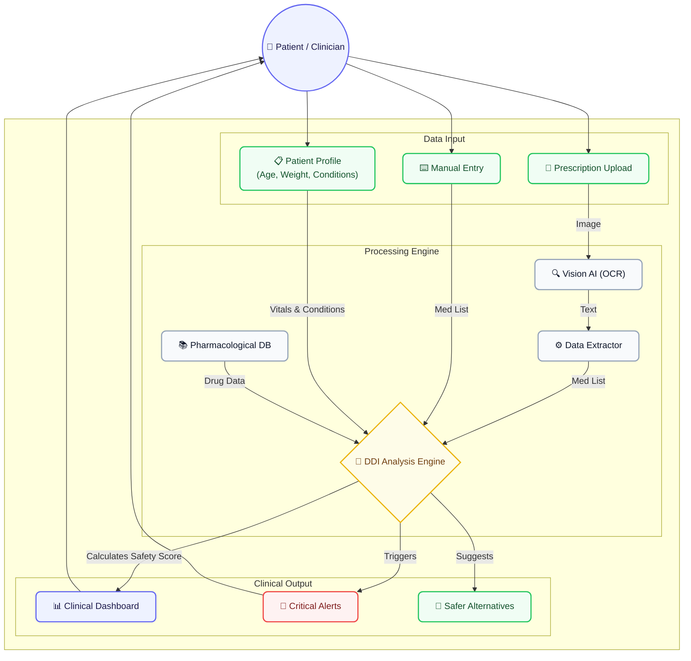
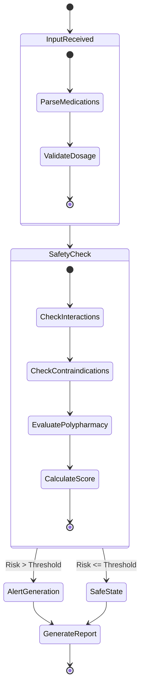

# 🏥 DDI-CDS (Clinical Decision Support System)

[](https://react.dev/)
[](https://tailwindcss.com/)
[](https://vitejs.dev/)
[](https://www.typescriptlang.org/)
[](https://opensource.org/licenses/MIT)

### 🔗 [View Live Deployment](https://ddi-clinic-app.vercel.app/) | 🐙 [View GitHub Repository](https://github.com/Harshsharma-ui/ddi_clinic-app)

> **An intelligent Clinical Decision Support System designed to catch potentially dangerous drug-drug interactions, analyze polypharmacy risks, and ensure patient safety in real-time.**

---

## 📖 Table of Contents
- [Overview](#-overview)
- [Key Features](#-key-features)
- [System Architecture](#-system-architecture)
- [Decision Logic Flow](#-decision-logic-flow)
- [Tech Stack](#-tech-stack)
- [Getting Started](#-getting-started)
- [Deployment](#-deployment)
- [Contributing](#-contributing)

---

## 🔍 Overview

Medication errors and adverse drug events are a major concern in healthcare. **DDI-CDS** bridges the gap between complex pharmacological data and clinical practice. By utilizing advanced optical character recognition (OCR) and an intelligent interaction engine, the system evaluates patient prescriptions against their medical history, providing an immediate safety profile and flagging contraindications.

---

## ✨ Key Features

- **📄 Smart Prescription OCR**: Instantly digitize handwritten or printed prescriptions using advanced Vision APIs.
- **⚡ Real-time Interaction Matrix**: Detects overlapping side effects and severe Drug-to-Drug / Drug-to-Condition conflicts.
- **📊 Safety Score Dashboard**: Calculates an overall "Safety Score" by weighing interaction severity, age factors, and polypharmacy risks.
- **🔄 Drug Interchanger**: Suggests safer alternative medications when severe interactions are detected.
- **📱 Modern & Responsive UI**: Built with React, Tailwind CSS v4, and smooth Motion animations for an intuitive clinical experience.

---

## 🏗️ System Architecture

Below is the high-level architecture of the DDI-CDS platform. It demonstrates how patient data, prescription images, and manual inputs flow into the processing engine and output critical safety metrics.



---

## 🧠 Decision Logic Flow

This state diagram illustrates the internal processing steps the application undergoes once a prescription is submitted, making the automated decision process fully transparent.



---

## 💻 Tech Stack

### Frontend
- **Framework:** React 19 + Vite
- **Styling:** Tailwind CSS v4
- **Animations:** Motion
- **Icons:** Lucide React
- **Markdown:** React Markdown

### Backend / AI Integration
- **LLM/Vision Integration:** Google GenAI / Groq API (Configurable)
- **Runtime:** Node.js environment

---

## 🚀 Getting Started

Follow these instructions to set up the project locally.

### Prerequisites
- Node.js (v18 or higher recommended)
- npm or yarn package manager
- API Key from Groq or Google Gemini (for OCR features)

### Installation

1. **Clone the repository (if applicable)**
   ```bash
   git clone https://github.com/Harshsharma-ui/ddi_clinic-app.git
   cd ddi_clinic-app
   ```

2. **Install dependencies**
   ```bash
   npm install
   ```

3. **Environment Setup**
   Create a `.env.local` file in the root directory and add your API keys:
   ```env
   VITE_GROQ_API_KEY=your_groq_api_key_here
   # Or whichever API key you are using for the Vision model
   ```

4. **Start the Development Server**
   ```bash
   npm run dev
   ```
   The application will start on `http://localhost:3000`.

---

## 🌐 Deployment

The application is fully optimized for modern edge deployments.

1. Configure your environment variables (`VITE_GROQ_API_KEY`) in your hosting provider's dashboard.
2. The standard build command is:
   ```bash
   npm run build
   ```
3. **Recommended Host:** Deploy directly to **Vercel** or **Netlify** by linking your repository. The Vite configuration will handle the chunking and optimization automatically.

---

## 🤝 Contributing

We welcome contributions! If you'd like to improve the DDI-CDS system:

1. Fork the repository.
2. Create your feature branch (`git checkout -b feature/AmazingFeature`).
3. Commit your changes (`git commit -m 'Add some AmazingFeature'`).
4. Push to the branch (`git push origin feature/AmazingFeature`).
5. Open a Pull Request.

---
*Built with ❤️ for safer clinical practices.*
