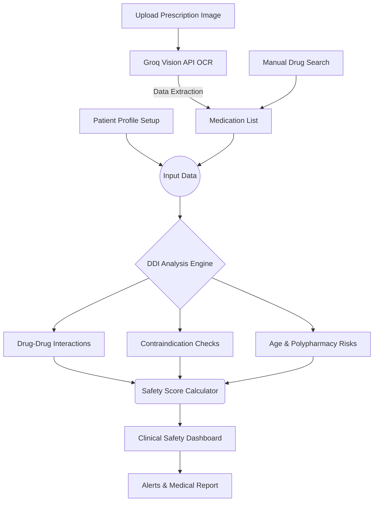

# DDI-CDS (Clinical Decision Support System)

**DDI-CDS** is an AI-powered Clinical Decision Support System that evaluates patient medications, medical history, and potential drug conflicts in real-time to enhance clinical safety.

## Application Flow



## Features

- **Smart OCR**: Uses Groq's Vision API (LLaMa 3.2 11B) to instantly digitize handwritten or printed prescriptions.
- **Interaction Matrix**: Provides real-time alerts for Drug-to-Drug and Drug-to-Condition conflicts based on patient history.
- **Safety Dashboard**: Calculates an overall "Safety Score" by weighing interactions, polypharmacy, and age risks.
- **Modern UI**: Fully responsive frontend built with React, Tailwind CSS v4, and Motion animations.

## Getting Started

1. **Install dependencies:**
   ```bash
   npm install
   ```

2. **Setup environment:**
   Create a `.env.local` file with your Groq API key:
   ```env
   VITE_GROQ_API_KEY=your_groq_api_key_here
   ```

3. **Run locally:**
   ```bash
   npm run dev
   ```

## Deployment

Built with Vite and fully optimized. Deployed directly to **Vercel** by configuring `VITE_GROQ_API_KEY` in their respective dashboard settings and running `npm run build`.
